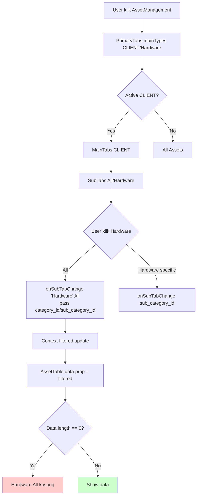

# AssetManagement Filter Flowchart

    
## Root Cause Candidates:
1. tabMeta.CLIENT.sub_category_ids.Hardware = null → filter kosong
2. useAssetPage local filter tidak match data
3. Backend /assets API return empty untuk params itu

